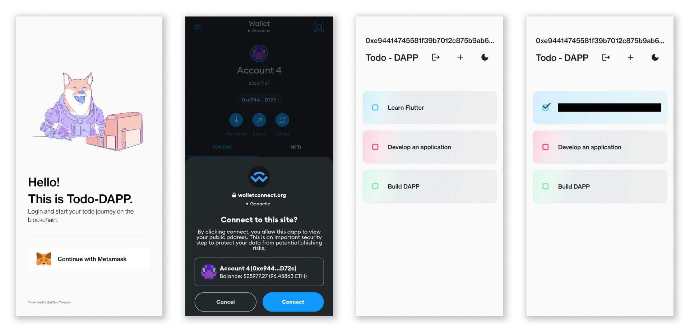

# Todo-DAPP

This project is a basic mobile Todo App build with Flutter.

The backend consist in a Solidity contract running on the Ethereum Blockchain.

---

## Contract

The Solidity contract allows different user to store and retrive Todos from the blockchain.

It has been built with [Truffle](https://trufflesuite.com/truffle/) and deployed over [Ganache](https://trufflesuite.com/ganache/).

---

## Mobile app

The app has been developed in Flutter.

The following dependencies have been used to interact with the contract:

- [web3dart](https://pub.dev/packages/web3dart)
- [walletconnect_dart](https://pub.dev/packages/walletconnect_dart)

It currently supports only [Metamask](https://metamask.io/) as a provider.
